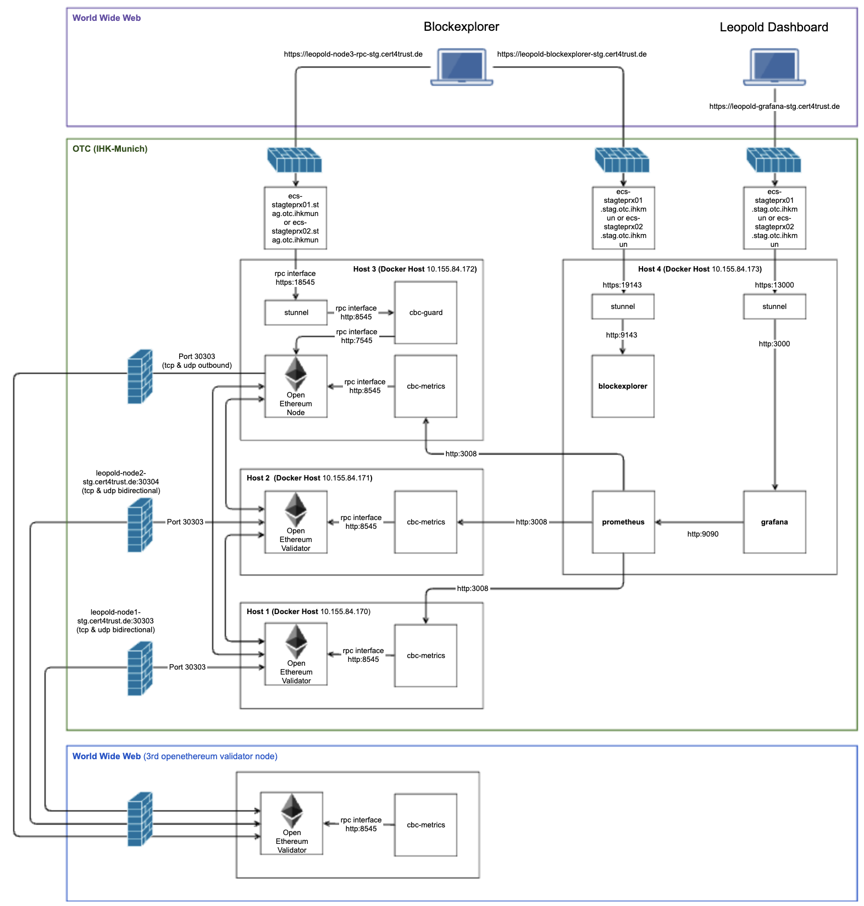
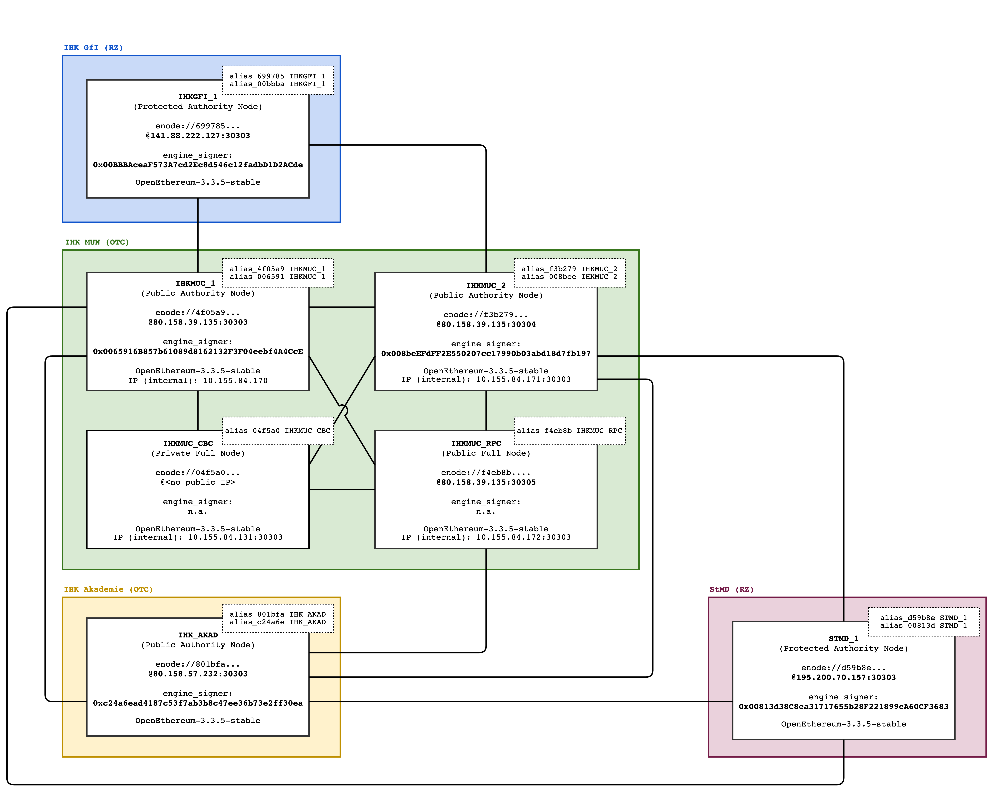

# OpenEthereum Test Client for Leopold Blockchain 

How can I access the Leopold test environment?

## 2. Getting Started

### 2.1 Two Secret Files will be needed

- /environment/staging/secrets/AccountMnemonic
- /environment/staging/secrets/NetworkMnemonic

Please, get in contact with [sprunck@muenchen.ihk.de](mailto:sprunck@muenchen.ihk.de) for more details.

### 2.2 Authorize executable files

After downloading, the executable files under Linux must also be given appropriate rights. Since different binaries 
are needed for Ubuntu and macOS, the genKeys.sh script decides which ones should be executed.

```shell
chmod +x \*.sh
chmod +x ./ethUtils_ubuntu/\*
chmod +x ./ethUtils_mac/\*
```

### 2.3 Start the test node

```shell
./start_staging.sh
```

## 2. Architecture

The following diagram shows the Leopold OTC staging environment. Within the IHK Munich (green box), there are 
three OpenEthereum nodes that represent the actual blockchain. Two of these nodes are validator nodes, namely 
Host 1 and 2. A third node serves only as an API interface, providing an RPC interface to the outside, namely 
Host 3. All other software components are used for monitoring the Leopold blockchain.

### 2.1 Deployment



### 2.2 Topology




